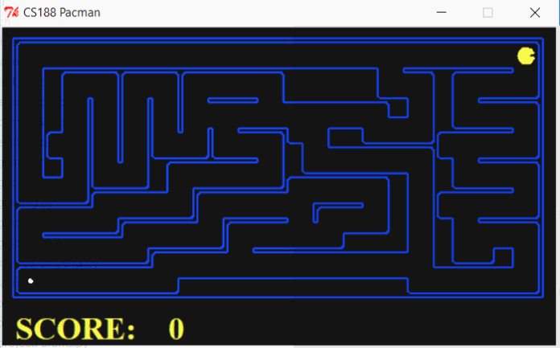
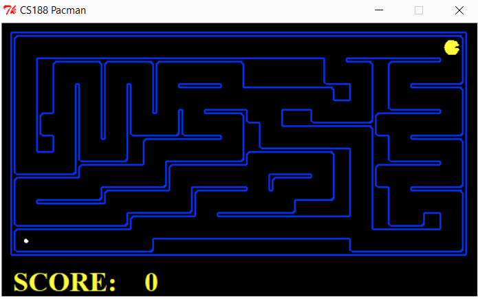
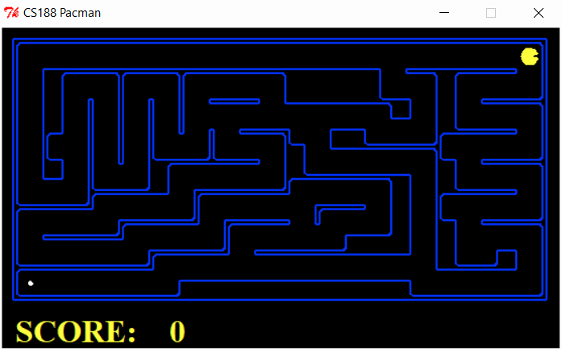
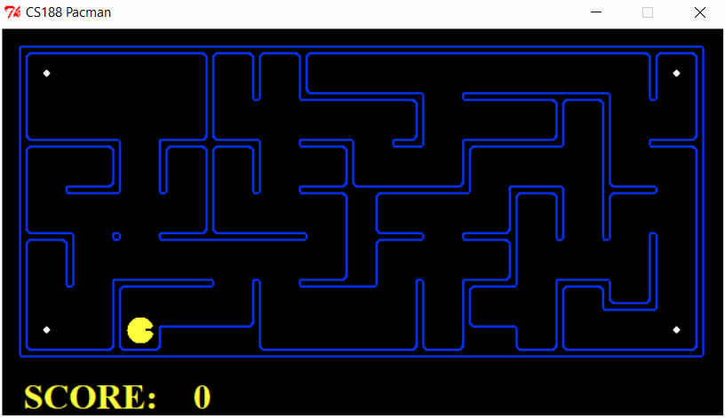
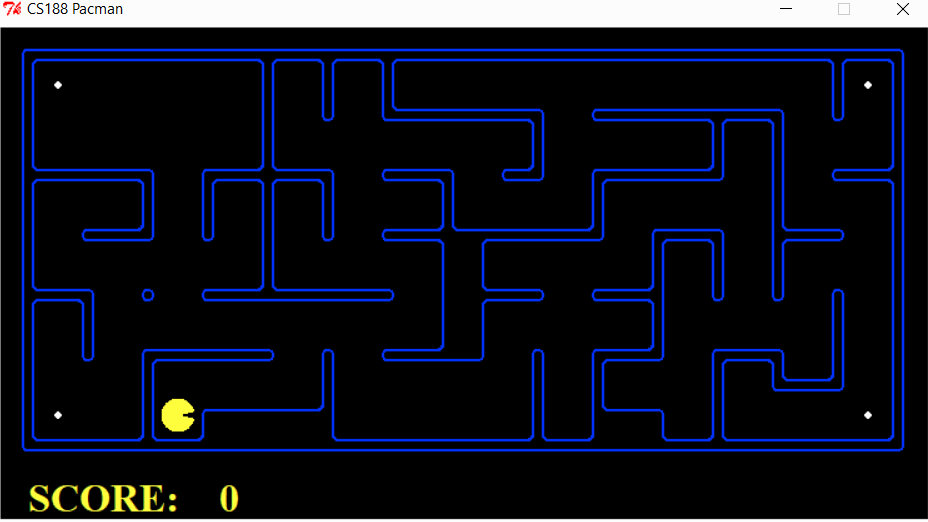
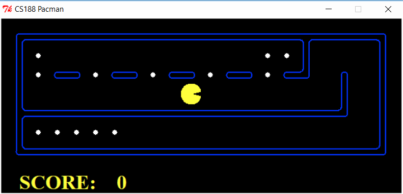
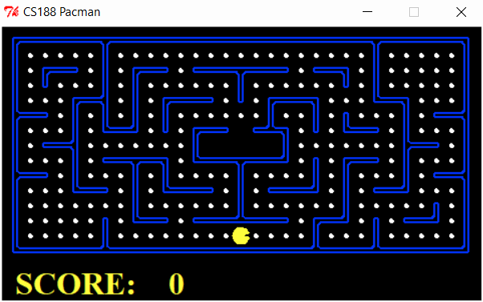

# Search

Project Details: http://ai.berkeley.edu/search.html

## Q1 - Depth First Search
---

## Q2 - Breadth First Search
---

## Q4 - A* Search
---

## Q5 - Finding all the corners
---

## Q6 - Corners Problem: Heuristic
---

## Q7 - Eating all the dots
---

## Q8 - Suboptimal Search 
---

